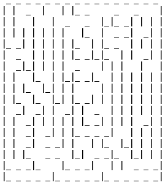

# MicroMouse WebGL

This project consists of a visualization tool for the Micromouse contest, developed purely in [WebGL](https://get.webgl.org/). \
The was a project initially developed in the course of Visual Computing, in the 4th year of MIECT in University of Aveiro. \
It was developed and tested in Firefox.

## Index

1. [Models](#models)
2. [Maps](#maps)
3. [Cameras](#cameras)
4. [Movement](#movement)
   - [Script Functions](#script-functions)
5. [UI](#ui)
6. [Issues](#issues)

## Models

</img>

The visulizer utilizes 4 models to build the whole enviroment that consist of:
- Floor
- Post
- Wall
- Mouse

The maze is then built taken into account the dimensions described by the [Robotics Society of America](http://robogames.net/rules/maze.php).

&nbsp;

## Maps

Type A          | Type B
:-------------: | :-------------:
 | 
walls and posts as `#` and the free cells and empty walls as `-` | `\|` represent vertical walls and `_` the horizontal walls

## Cameras

Free Camera | Top View | First Person
----------- | ------------- | -------------
 |  | 
Drag to move maze around X and Z axis and `Shift+Scroll` to zoom in and out| |

## Movement

Free Movement | Constrained | Script
------------- | ------------- | -------------
 |  | 
`W,A,S,D` to move arround the maze freely, with collisions | `W,A,S,D` to move arround the maze cell be cell | Write script in JavaScript using predefined function to move the mouse cell by cell

### Script Functions

Bellow are the predefined functions and variables to be used in the script movement.

Functions:
- forward()
- back()
- right()
- left()

Variables:
- maze           -- global var (all other variables created inside the script don't persist through next loop)
- pathIsClear[0] -- boolean - true means no left wall
- pathIsClear[1] -- boolean - true means no front wall
- pathIsClear[2] -- boolean - true means no right wall

## UI

<kbd>
  
</kbd>

&nbsp;

You can hover over objects to get an help/description on what that object does.

## Issues

There are a couple of issues with the project has it stands now, with the most problematic being performance issues. \

Some of the issues are:
- Performance issues
- Script movement bug as described in [#3](https://github.com/dedukun/micromouse-webgl/issues/3)
- The code should be refactor to make it easier to understand/develop
- Better models
